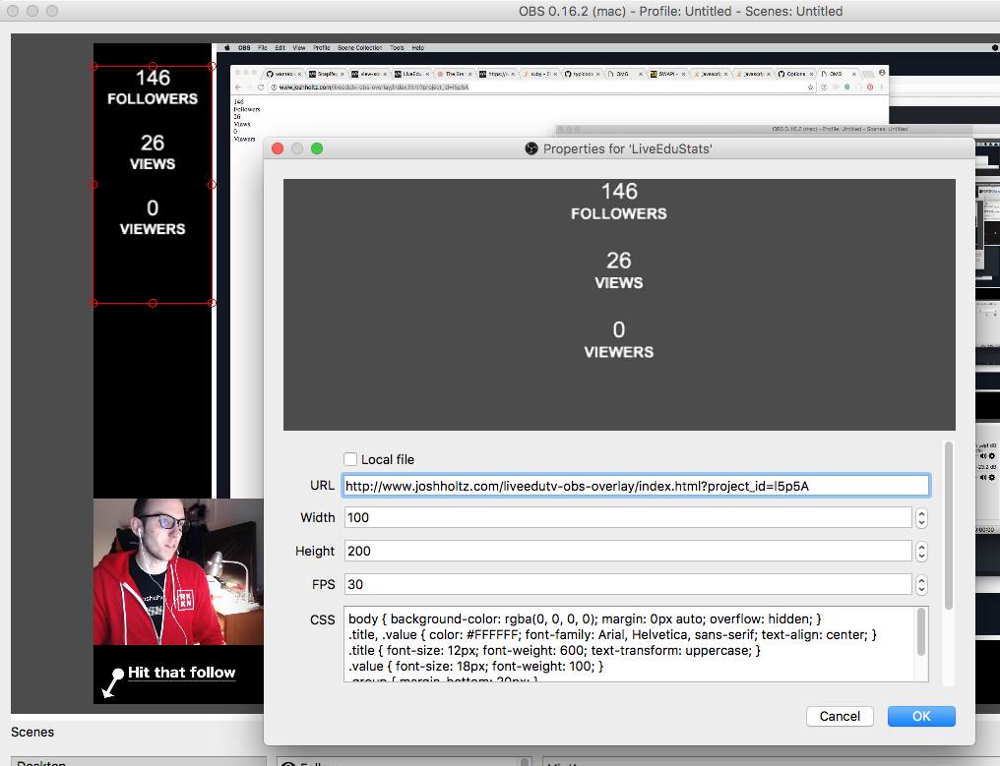

# LiveEdu.tv OBS Overlay

Use this simple static webpage for an OBS overlay to display stats about your LiveEdu.tv project.

- Using values from JSON API at `https://www.liveedu.tv/api/v2/projects/<project_id>/livestream/`
  - `user.count_followers`
  - `viewsoverall`
  - `viewers_live`

Example URL: http://www.joshholtz.com/liveedutv-obs-overlay/index.html?project_id=l5p5A

## Installation



### URL in OBS
```
http://www.joshholtz.com/liveedutv-obs-overlay/index.html?project_id=the_project_id
```

### Edit CSS in OBS

```css
body { background-color: rgba(0, 0, 0, 0); margin: 0px auto; overflow: hidden; }
.title, .value { color: #FFFFFF; font-family: Arial, Helvetica, sans-serif; text-align: center; }
.title { font-size: 12px; font-weight: 600; text-transform: uppercase; }
.value { font-size: 18px; font-weight: 100; }
.group { margin-bottom: 20px; }
#last_follower { display: none; }
```
